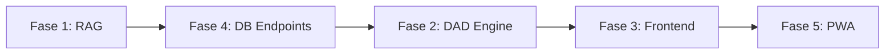

# Plan de Ejecución — InglobalsApp

> **Estado:** Plan listo para implementar  
> **Fases:** 5 | **Tareas:** 24 | **Dependencias:** Fase 1 → Fase 4 → Fase 2 → Fase 3 → Fase 5

---

## Resumen del Proyecto

Simulador DAD (Dynamical Audit Dashboard) — Aplicación PWA que permite a clientes cargar leyes (PDFs), simular auditorías legales mediante IA (DeepSeek) con búsqueda semántica RAG, y descargar memorias técnicas.

### Stack

| Capa | Tecnología |
|------|-----------|
| Backend | Python 3.12+, FastAPI, ChromaDB, SQLite, SentenceTransformers, pdfplumber |
| Frontend | Vue 3 + Vite 8, Tailwind v4, PWA (vite-plugin-pwa) |
| IA | DeepSeek API (compatible OpenAI SDK) |
| DB Vectorial | ChromaDB (persistencia local) |
| DB Relacional | SQLite (WAL mode) |

---

## Fase 1 — Backend: Sistema RAG con ChromaDB

### Diagnóstico

El archivo `backend/app/core/rag.py` existe pero usa **FAISS** (`IndexFlatIP`) en lugar de ChromaDB, aunque el directorio de persistencia se llame `chroma/`. El `requirements.txt` tiene errores: `uvicorn[standard]==0.34.0` (sintaxis inválida) y `pypdf2==3.0.1` (paquete deprecado).

### Tareas

| # | Archivo | Acción | Detalle |
|---|---------|--------|---------|
| 1.1 | `backend/requirements.txt` | Editar | Reemplazar `pypdf2==3.0.1` por `pdfplumber` y `chromadb`. Arreglar `uvicorn[standard]==0.34.0` → `uvicorn[standard]` (sin pin de versión para evitar conflictos) |
| 1.2 | — | Bash | Ejecutar `pip install -r requirements.txt` desde `backend/` para instalar nuevas dependencias |
| 1.3 | `backend/app/core/rag.py` | Reescribir completo | Migrar de FAISS a ChromaDB (`chromadb.PersistentClient`). Cambiar `load_pdf_text()` de PyPDF2 a pdfplumber. Adaptar `chunk_text()`, `index_document()`, `search_legal_context()`, `list_documents()`, `delete_document()` |
| 1.4 | `backend/app/database.py` | Editar | Eliminar funciones FAISS: `get_faiss_index()`, `save_faiss_index()`, `get_embedding_model()`. Dejar solo SQLite CRUD (`init_sqlite`, `insert_simulation`, `get_simulations`, `get_simulation_by_expediente`) |
| 1.5 | `backend/app/config.py` | Editar | Actualizar `CHROMA_DIR` para que apunte a `data/chroma/` como persistencia de ChromaDB real |
| 1.6 | `backend/app/api/documents.py` | Editar | Adaptar `search_legal_context()` para usar `collection.query()` de ChromaDB. Actualizar `list_documents()` y `delete_document()` para la API de ChromaDB |

### Comportamiento esperado

- `POST /api/v1/documents/upload` recibe PDF, lo procesa con pdfplumber, lo chunktea (1000 chars, overlap 200), lo embediza con `all-MiniLM-L6-v2`, y lo guarda en ChromaDB con metadatos (título, categoría, fecha)
- `POST /api/v1/documents/search` recibe query + categoría opcional y retorna los chunks más relevantes vía búsqueda semántica
- `DELETE /api/v1/documents/{doc_id}` elimina documento y sus chunks de ChromaDB
- `GET /api/v1/documents` lista documentos indexados (agrupados por doc_id, con conteo de chunks)

---

## Fase 2 — Backend: Ecuación DAD Estricta

### Diagnóstico

El `SYSTEM_PROMPT` en `engine.py` ya obliga JSON con `response_format={"type": "json_object"}`, pero falta:
- Campo `thinking` con el razonamiento paso a paso de la IA
- Validación estricta: si `compliance_score` no es 100, `is_valid` debe ser `false`
- Mapeo de cada criterio a su base legal (`legal_basis`)
- Efecto rebote: si un criterio falla, la simulación debe reflejarlo visualmente

### Tareas

| # | Archivo | Acción | Detalle |
|---|---------|--------|---------|
| 2.1 | `backend/app/core/engine.py` | Editar | Refinar `SYSTEM_PROMPT`: (a) Obligar formato JSON exacto `{"thinking": "...", "result": {...}}`, (b) Instrucción explícita de NUNCA inventar artículos sin contexto RAG, (c) Efecto rebote: si `compliance_score != 100`, forzar `is_valid = false`, (d) Evaluar OBLIGATORIAMENTE los 5 criterios (Cs, Cv, CS, GT, NI) |
| 2.2 | `backend/app/models/schemas.py` | Editar | Añadir `thinking: str` y `legal_basis: dict[str, str]` a `DADResult`. Cada entrada de `legal_basis` mapea nombre de criterio → cita legal |
| 2.3 | `backend/app/core/engine.py` | Editar | Añadir validación post-parseo: verificar que los 5 criterios existan, que `compliance_score` esté entre 0-100, consistencia `score < 100 → is_valid = false` |
| 2.4 | `backend/app/models/schemas.py` | Editar | Asegurar que `SimulateResponse` incluya `thinking` y `legal_basis` como campos planos (no anidados) para consumo directo del frontend sin re-mapeo |

### Comportamiento esperado

- `POST /api/v1/simulate` recibe `{prompt, entity_type, framework}`, consulta ChromaDB por contexto legal, construye prompt, llama a DeepSeek, parsea JSON, valida, calcula expediente (`AUD-YYYY-XXXXXX`), guarda en SQLite, retorna `SimulateResponse`
- La IA devuelve `thinking` con su razonamiento y `result` con los datos estructurados
- Si no hay documentos RAG cargados, la IA usa el contexto por defecto pero lo indica en `thinking`

---

## Fase 3 — Frontend: Modularización y Navegación

### Diagnóstico

**Lo que ya funciona:**
- `EmulatorView.vue`, `RepositoryView.vue`, `HistoryView.vue` ya existen
- `AppNav.vue` con sidebar + bottom nav ya implementado
- `App.vue` ya intercambia vistas con `currentView`

**Lo que NO funciona:**
- `DocUploader.vue` solo lee el filename, **nunca llama a la API**
- `HistoryView.vue` usa datos `sampleEntries` hardcodeados en lugar de la API real
- `HelloWorld.vue` es código muerto (starter template)
- `ReportCard.vue` tiene botón "Descargar" no funcional
- Los componentes no tipan correctamente contra los schemas del backend

### Tareas

| # | Archivo | Acción | Detalle |
|---|---------|--------|---------|
| 3.1 | `RepositoryView.vue` + `DocUploader.vue` | Editar | Conectar subida de PDF a `api.uploadDocument()` con FormData. Refrescar `documents` del store tras subida exitosa. Mostrar feedback visual |
| 3.2 | `HistoryView.vue` | Reescribir | Eliminar `sampleEntries`. En `onMounted`, llamar `api.getHistory()`. Mapear campos backend (`expediente_id`, `created_at`, `entity_type`, `prompt`, `compliance_score`, `criteria_*`) al frontend |
| 3.3 | `HistoryTable.vue` | Editar | Props tipadas contra `SimulationRecord`. Columnas: Expediente, Fecha, Entidad, Consulta, Cumplimiento (%) |
| 3.4 | `ReportCard.vue` | Editar | Hacer funcional "Descargar Certificado DAD": llamar endpoint de exportación o generar contenido descargable en JSON |
| 3.5 | `src/components/HelloWorld.vue` | Eliminar | Borrar componente heredado de Vite starter que no se usa en ninguna vista |
| 3.6 | `appStore.js` | Editar | Añadir lógica para poblar `activeLaws` dinámicamente desde `simulationResult.legal_basis` |
| 3.7 | `ChatFeed.vue` | Editar | Adaptar `formatResponse()` para mostrar `thinking` (colapsable) y `legal_basis` (citas al pie) desde la respuesta de la IA |

### Comportamiento esperado

- **Repositorio:** Usuario arrastra/sube PDF → se envía al backend → aparece tarjeta en el grid
- **Historial:** Al entrar, se cargan simulaciones reales desde la API, no datos de mentira
- **Emulador:** La respuesta de la IA incluye sección "Razonamiento" (thinking) y "Base Legal" (citas por criterio)
- Navegación fluida entre las 3 vistas sin router — usando `currentView` reactivo

---

## Fase 4 — Base de Datos: Persistencia de Historial

### Diagnóstico

**Lo que ya funciona:**
- `database.py` crea tabla `simulations` con 14 columnas
- `GET /api/v1/history`, `GET /api/v1/history/{expediente_id}`
- `insert_simulation()` guarda cada simulación

**Lo que falta:**
- Filtros por fecha (`from_date` / `to_date`)
- Endpoint de exportación de memoria técnica (`/export`)
- Endpoint de estadísticas (`/stats`)
- El frontend no consume estos endpoints (se arregla en Fase 3)

### Tareas

| # | Archivo | Acción | Detalle |
|---|---------|--------|---------|
| 4.1 | `backend/app/api/history.py` | Editar | Añadir query params opcionales `from_date` y `to_date` (formato `YYYY-MM-DD`) al `GET /api/v1/history` |
| 4.2 | `backend/app/api/history.py` + `database.py` | Editar | Crear `GET /api/v1/history/{expediente_id}/export` que retorne JSON completo con todos los campos de la simulación para descarga como "Memoria Técnica" |
| 4.3 | `backend/app/api/history.py` + `database.py` | Editar | Crear `GET /api/v1/history/stats` → `{total, validas, invalidas, por_entidad: {publica, privada, mixta}, criterio_mas_fallado, promedio_cumplimiento}` |
| 4.4 | `backend/app/api/history.py` | Editar | Actualizar `GET /api/v1/history` para retornar también `criteria_*` planos para que el frontend no tenga que parsear el JSON de criterios |

### Comportamiento esperado

- El frontend puede filtrar el historial por rango de fechas
- Hay un endpoint `/stats` para un futuro dashboard visual
- La exportación descarga un JSON completo formateado como "Memoria Técnica"
- La respuesta de `/history` incluye los 5 criterios como campos planos para consumo directo

---

## Fase 5 — PWA: Offline + Iconos

### Diagnóstico

**Lo que ya funciona:**
- `vite-plugin-pwa` configurado con `registerType: 'autoUpdate'`
- Service worker se genera en `dist/sw.js`
- Manifest se genera con nombre "DAD -- Dynamical Audit Dashboard"

**Lo que falta:**
- Iconos `icon-192.png` y `icon-512.png` referenciados en el manifest pero **no existen** en `public/`
- No hay mensaje de "modo offline" cuando el usuario está sin conexión
- El precaching de `vite-plugin-pwa` no está configurado con `globPatterns` ni `navigateFallback`

### Tareas

| # | Archivo | Acción | Detalle |
|---|---------|--------|---------|
| 5.1 | `public/icon-192.png`, `public/icon-512.png` | Colocar | **Tú proporcionas** los archivos PNG. Yo dejo el manifest configurado para referenciarlos |
| 5.2 | `vite.config.js` | Editar | Configurar `workbox.globPatterns` para precachear todo (`**/*.{js,css,html,svg,png,ico}`). Añadir `navigateFallback: '/index.html'` para SPA offline |
| 5.3 | `src/components/layout/OfflineBanner.vue` | Crear | Componente que escucha `navigator.onLine` + eventos `window.online`/`offline`. Muestra banner "🔌 Modo de consulta local activo — los datos mostrados son de la última sesión" cuando está offline |
| 5.4 | `src/App.vue` | Editar | Integrar `<OfflineBanner />` como elemento fijo en la parte superior |
| 5.5 | — | Bash | Ejecutar `npm run build` y verificar en `dist/`: que existan `sw.js`, `manifest.webmanifest`, iconos, y que el precache list incluya todos los assets |

### Comportamiento esperado

- App instalable desde Chrome/Firefox/Safari con icono personalizado
- Si el usuario abre la app sin internet, se carga desde cache y aparece el banner "Modo de consulta local activo"
- El service worker se actualiza automáticamente cuando hay nueva versión (`autoUpdate`)
- Navegación offline: todas las rutas SPA funcionan desde cache

---

## Orden de Ejecución Recomendado

| Secuencia | Fase | Razón |
|:--------:|------|-------|
| 1 | **Fase 1** | El sistema RAG es la base de todo. Sin ingestión de PDFs y búsqueda semántica, el simulador no tiene contexto legal |
| 2 | **Fase 4** | Los endpoints de historial deben existir antes de conectar el frontend. Además, `engine.py` depende de `database.py` |
| 3 | **Fase 2** | Refinar el prompt y la validación de la IA para que los datos que lleguen al frontend tengan la estructura correcta |
| 4 | **Fase 3** | Conectar el frontend a la API real (DocUploader, HistoryView). Se hace al final porque requiere que todas las APIs estén listas |
| 5 | **Fase 5** | Toque final: PWA, offline, iconos. No afecta la lógica de negocio |

---

## Resumen de Archivos Modificados

### Backend (6 archivos)

| Archivo | Cambio |
|---------|--------|
| `backend/requirements.txt` | Swap pypdf2→pdfplumber, añadir chromadb, fix uvicorn |
| `backend/app/core/rag.py` | Reescribir: FAISS → ChromaDB, PyPDF2 → pdfplumber |
| `backend/app/database.py` | Eliminar funciones FAISS |
| `backend/app/config.py` | Actualizar CHROMA_DIR |
| `backend/app/api/documents.py` | Adaptar a ChromaDB API |
| `backend/app/core/engine.py` | Refinar system prompt + validación |
| `backend/app/models/schemas.py` | Añadir thinking, legal_basis |
| `backend/app/api/history.py` | Añadir filtros, export, stats |

### Frontend (9 archivos)

| Archivo | Cambio |
|---------|--------|
| `frontend/vite.config.js` | Configurar globPatterns, navigateFallback |
| `frontend/src/components/HelloWorld.vue` | **Eliminar** |
| `frontend/src/components/repository/DocUploader.vue` | Llamar upload API |
| `frontend/src/views/RepositoryView.vue` | Refrescar docs tras upload |
| `frontend/src/views/HistoryView.vue` | Consumir API real |
| `frontend/src/components/history/HistoryTable.vue` | Props tipadas |
| `frontend/src/components/history/ReportCard.vue` | Export funcional |
| `frontend/src/components/layout/OfflineBanner.vue` | **Crear nuevo** |
| `frontend/src/App.vue` | Integrar OfflineBanner |
| `frontend/src/stores/appStore.js` | Poblar activeLaws desde legal_basis |
| `frontend/src/components/emulator/ChatFeed.vue` | Mostrar thinking + legal_basis |
| `frontend/src/services/api.js` | Añadir funciones stats, export |

### Nuevos archivos a crear

| Archivo | Propósito |
|---------|-----------|
| `frontend/public/icon-192.png` | **Tú lo proporcionas** |
| `frontend/public/icon-512.png` | **Tú lo proporcionas** |
| `frontend/src/components/layout/OfflineBanner.vue` | Banner de modo offline |

---

## Criterios de Aceptación

- [ ] **Fase 1:** Subir PDF → se chunktea → se embediza → se guarda en ChromaDB → se puede buscar por query
- [ ] **Fase 1:** El `requirements.txt` se instala sin errores
- [ ] **Fase 2:** La IA responde en JSON estricto con `thinking`, `result`, `legal_basis`, 5 criterios, y `compliance_score` consistente con `is_valid`
- [ ] **Fase 3:** Subir PDF desde el frontend → aparece en el grid
- [ ] **Fase 3:** El historial muestra datos reales de la base de datos, no hardcodeados
- [ ] **Fase 4:** `/history?from_date=2025-01-01&to_date=2025-12-31` funciona
- [ ] **Fase 4:** `/history/stats` retorna estadísticas correctas
- [ ] **Fase 4:** `/history/{exp}/export` descarga JSON con la memoria técnica
- [ ] **Fase 5:** `npm run build` genera service worker, manifest, y precache
- [ ] **Fase 5:** Al desconectar internet, aparece banner "Modo de consulta local activo"
